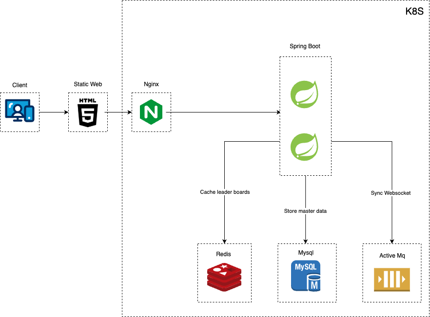
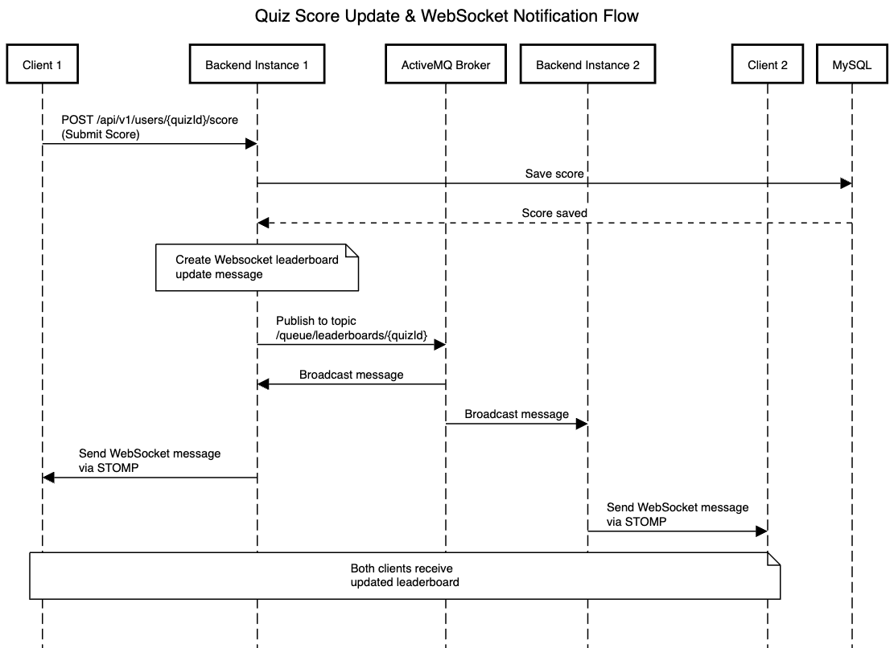

# Quiz Application with Real-time Leaderboard

A scalable quiz application with real-time leaderboard updates using WebSocket, built with Spring Boot and simple HTML.

## Features

- Real-time leaderboard updates using WebSocket
- User authentication with JWT
- Scalable architecture with Kubernetes
- Message queuing with ActiveMQ
- Caching with Redis
- Monitoring with Prometheus & Grafana


## Project Structure
``` lua
quiz
├── backend -- Spring boot application
├── frontend -- Static web frontend
├── eureka -- Service discovery (running in docker)
├── gateway -- Spring Cloud Gateway (running in docker)
└── k8s -- Kubernetes manifests
```
## Architecture
#### System architecture diagram



#### Messaging sequence diagram

## Technology Stack

- **Backend**: Spring Boot 3.2.3
    - Spring Security
    - Spring WebSocket
    - Spring Data JPA
    - Spring Cloud Netflix Eureka
    - Micrometer + Prometheus

- **Frontend**:
    - HTML5
    - JavaScript
    - Bootstrap 5
    - SockJS + STOMP

- **Infrastructure**:
    - Kubernetes
    - Docker
    - Nginx
    - MySQL 8
    - Redis 7
    - ActiveMQ Artemis
    - Prometheus & Grafana

## Getting Started

### Prerequisites

- Docker & Docker Compose
- Kubernetes (minikube)
- Java 17
- Maven

### Run Local

1. Start dependencies using Docker Compose:
+ `cd DEV-resources && docker-compose up -d quiz-activemq quiz-mysql-db quiz-redis`
2. Run the backend app:
+ `cd backend && mvn spring-boot:run -Dspring.profiles.active=local`
+ `or you can use Intelli IDEA to run`
3. Open frontend/index.html in a browser

### Run in docker
1. Start all dependencies using Docker Compose:
+ `cd DEV-resources && docker-compose up -d`
2. Open `localhost:3000` in a browser

### Run in k8s (minikube)
1. Run minikube local:
+ `minikube start --driver=docker`
2. Point shell to minikube's docker daemon:
+ `eval $(minikube docker-env)`
3. Build images
+ `docker build -t quiz-frontend:latest ./frontend`
+ `docker build -t quiz-backend:latest ./backend`
4. Apply Kubernetes manifests:
+ `kubectl apply -k k8s/base`
5. After all pod are running:
+ `minikube service nginx --url`
+ Open that address in a browser

